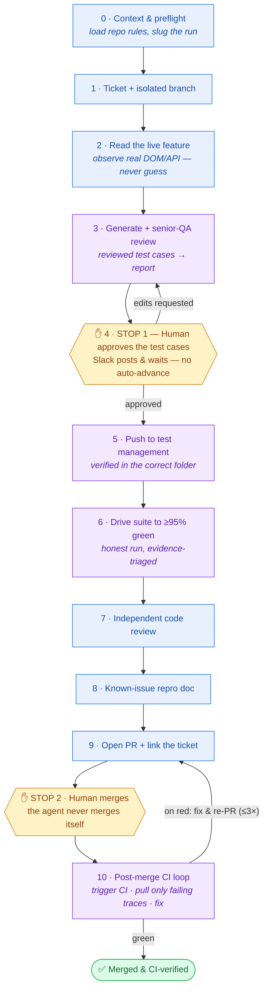

# Hi, I'm Mayur 👋

**QA Automation Engineer** building **AI-agent skills** that make quality engineering faster, more thorough, and more honest.

Over the last stretch I designed and built a **complete, agent-driven QA pipeline** — one command takes a software feature from *nothing* to a **merged, CI-verified feature**: it writes senior-QA-reviewed test cases, drives a real ≥95%-green automated suite, opens the PR, and runs the post-merge CI cleanup — pausing only at the two points where a human must decide.

This page walks through the whole system, flagship first.

> ℹ️ These are **generalized portfolio write-ups**. The implementations were built for a proprietary internal product; all employer-specific identifiers, infrastructure, and workflows have been removed.

---

## Contents

- [The system at a glance](#the-system-at-a-glance)
- [⭐ Flagship — QA Full-Flow Orchestrator](#-flagship--qa-full-flow-orchestrator)
- [The building blocks](#the-building-blocks)
  - [1 · QA Test Case Generator](#1--qa-test-case-generator)
  - [2 · Test Suite → Green](#2--test-suite--green)
  - [3 · Jenkins CI Runner](#3--jenkins-ci-runner)
  - [4 · Slack Notifier](#4--slack-notifier)
- [How the pieces fit together](#how-the-pieces-fit-together)
- [Skills & tools](#skills--tools)

---

## The system at a glance

| Piece | What it does | Highlights |
|-------|--------------|-----------|
| ⭐ **Full-Flow Orchestrator** | Conducts the whole pipeline: feature → merged, CI-verified feature | 11 phases · 2 human stops · crash-safe & resumable |
| **Test Case Generator** | UI artifact → senior-QA-reviewed test cases → report | Two-pass design; the review pass is the point |
| **Suite → Green** | Test cases → honest ≥95%-green pytest + Playwright suite | Anti-cheating "honesty gate"; evidence-based triage |
| **Jenkins CI Runner** | Headless CI trigger + selective evidence fetch | Pulls back *only* failing traces, not the bulk archive |
| **Slack Notifier** | The human-in-the-loop backbone | Blocking approval gates vs. non-blocking FYIs |

Everything below is a component I designed and built; the orchestrator is what ties them into one unattended-but-safe workflow.

---

## ⭐ Flagship — QA Full-Flow Orchestrator

**One command takes a feature from nothing to a merged, CI-verified feature.** It's an *orchestrator*, not another engine: each phase either does lightweight "glue" work (create a ticket, read the live UI, raise the PR) or **calls one of the specialized skills below**. Every phase reads and writes a single **durable run manifest**, so a crash, a long CI wait, or even a brand-new session all resume exactly where the run left off.

There are exactly **two human stops** — approve the test cases, and merge — because those are the only two decisions that genuinely need judgment. Everything else runs on its own.

### Pipeline

### The phases

| # | Phase | Type | What it does |
|---|-------|------|--------------|
| 0 | Context & preflight | glue | Loads the repo's hard rules, derives a run slug, validates every precondition before touching anything. |
| 1 | Ticket + branch | glue | Creates a tracked ticket and an isolated working branch. |
| 2 | Read the live feature | glue | A deep, **read-only** pass over the real UI — every control, dropdown, validation rule, and network call — so nothing downstream is guessed. |
| 3 | Generate + review + report | engine | Calls the **Test Case Generator**: broad-coverage draft → senior-QA review pass → formatted report. |
| 4 · **STOP 1** | **Human approves the cases** | **stop** | **A hard gate.** Slack posts the report and *waits*; nothing reaches the test-management tool until a person approves. Edits loop back to Phase 3. No timeout auto-advance, ever. |
| 5 | Push to test management | engine | Imports the approved cases and verifies they landed in the correct folder. |
| 6 | Drive suite to ≥95% green | engine | Calls **Suite → Green**: implement → run → evidence-triage failures → an honest ≥95%-green result. |
| 7 | Independent code review | glue | An automated review pass; findings resolved (or explicitly deferred) before the PR. |
| 8 | Known-issue repro doc | glue | For every deferred case, a manual repro guide a non-engineer can follow in minutes (posted to Slack as an FYI). |
| 9 | Open PR + hand-off | glue | Raises the PR, links the ticket, attaches every artifact and metric, posts the PR link to Slack. |
| **STOP 2** | **Human merges** | **stop** | The PR is raised and linked — **merging is always a human action.** The agent never calls a merge API. |
| 10 | Post-merge CI loop | engine | After merge, calls the **Jenkins CI Runner**: trigger the build, wait for the result, and **on red pull back only the failing traces**, fix, and re-PR — a bounded loop capped at a few cycles. |

### Design decisions worth calling out

- **Only two human stops, and they're the right two.** Test-case quality and the merge decision need judgment; everything else — including the post-merge CI cleanup — is automated. That's the difference between an agent you babysit and one you can trust to run unattended.
- **Resumability is a first-class feature.** The run manifest lets the pipeline survive crashes, long CI waits, and session restarts — essential for a workflow meant to run repeatedly across many features.
- **A dry-run mode.** Validates every precondition and prints the resolved plan with zero side effects, so you see exactly what a run *would* do before committing.
- **Idempotent, detect-or-create everywhere.** Re-running never double-creates a ticket, branch, or PR.
- **Grounded in reality.** The live-feature read means every selector, label, and value traces back to a real observation — killing the "invented behavior" class of bad test at the source.
- **It never merges itself.** A deliberate, non-negotiable boundary.

---

## The building blocks

Each of these stands on its own and is also called by the orchestrator.

### 1 · QA Test Case Generator

Turns a UI artifact — a screenshot, spec, or design — into **senior-QA-reviewed** test cases, delivered as a formatted report and pushed into a test-management tool.

The core idea: a single generation pass always produces happy-path-heavy coverage, so the skill runs a **second, adversarial pass** where the agent switches posture to a senior QA / QA manager and re-reviews its own draft for the gaps. That review step is why the output is release-grade instead of a rough draft.

- **Systematic coverage** — the generation pass walks a fixed set of axes (layout, RBAC, validation, API, cancel/dirty-state, persona, responsive, and per-control business effect) rather than inventing cases ad hoc.
- **Verify-then-write** — no behavior becomes a test assertion unless it was observed live or flagged as an open question.
- **Stable IDs + a retired-ID ledger** — test IDs are join keys, never renumbered across revisions.
- **Human gate before anything ships** — the push waits for explicit sign-off and expects multiple report revisions.

*Demonstrates:* test design · coverage modeling · senior-QA review methodology · report generation.

### 2 · Test Suite → Green

Takes already-written test cases and drives them to a **real, honest ≥95%-green pytest + Playwright suite** — implement → self-check → run → evidence-triage failures → fix → stop for human merge approval.

The word doing the work is *honest*: "green" only counts if it survives an anti-cheating gate.

- **Honesty machinery** — quarantined/known-bug tests are deselected out of the denominator; a skip is auto-converted to a failure unless it's a legitimate data/destructive skip, so you can't hit the target by relabeling failures. Green must come from a real run to (near-)exit-0.
- **Evidence over guessing** — every failure verdict cites a trace, DOM node, or API line (`fixable | product-bug | data-blocked | flake`).
- **No test that can't fail** — a falsification condition is mandatory; vacuous tests are linted out.
- **Data safety is a hard gate** — mutating tests run only against a scratch environment with a full snapshot/restore plan; production is strictly read-only.
- **Ordered for speed** — reuse one login, group by shared setup, isolate session-ending tests last.

*Demonstrates:* pytest · Playwright · Page Object Model · test-data safety · parallel execution · flake management · regression analysis.

### 3 · Jenkins CI Runner

Triggers CI (Jenkins) builds entirely from the command line — no browser, no manual parameter form — and, crucially, **pulls back only the evidence that matters** when a build goes red.

- **`trigger`** — kicks off a parametrized build with a fixed, safe parameter set, and handles CI's async reality: a trigger returns a *queue item*, not a build number, so it polls the queue for the real number (with a graceful timeout on a busy queue).
- **`fetch`** — always grabs the cheap, high-value files (console log + machine-readable report), reads the report to resolve exactly which tests failed, and downloads **only those failing tests' traces** — never the multi-hundred-MB bulk archive.
- **Secure auth by construction** — a scoped API token (never a password), loaded from a gitignored env file, never printed or logged; negotiates a CSRF crumb when required.

*Demonstrates:* CI/CD automation · REST API integration · async job/queue handling · selective artifact retrieval · secure token auth.

### 4 · Slack Notifier

The **human-in-the-loop backbone**. It knows the difference between a message that **blocks** (an approval gate) and one that just **informs** (an FYI), posts each in the right place, and never takes down the pipeline if Slack is unreachable.

| Call | When | Blocking? | Posts |
|------|------|-----------|-------|
| approval request | test cases ready (STOP 1) | **yes — waits** | Uploads the report + summary, @-mentions the reviewer, as a standalone post so the gate can't be missed |
| notify | PR opened / CI build done | no | PR link, or build number/URL + failing-test summary |
| upload doc | repro doc ready | no | Uploads the PDF, FYI only |
| run-status thread | throughout a run | no | One thread per run, so progress doesn't spam the channel |

- **Gate posts vs. FYI posts are deliberately different** — approvals are standalone and *wait*; routine progress is threaded so the channel stays quiet.
- **Graceful degradation** — if Slack isn't connected, it prints to stdout and carries on. A missing notification never fails a run.
- **No secrets in code** — auth is handled by the messaging integration; nothing hardcoded or logged.

*Demonstrates:* chat-ops integration · human-in-the-loop design · blocking vs. non-blocking patterns · graceful degradation.

---

## How the pieces fit together

The orchestrator is the conductor; the generator and suite-automation skills do the QA heavy lifting; the CI runner closes the loop after merge; and the Slack notifier keeps a human informed and in control throughout.

---

## Skills & tools

| Area | |
|------|---|
| **Languages** | Python |
| **Test automation** | pytest · Playwright · Page Object Model |
| **AI-agent engineering** | skill authoring · orchestration · workflow / state-machine design · idempotent & resumable pipelines · human-in-the-loop gating |
| **CI/CD** | Jenkins · quality gates · post-merge remediation loops |
| **Integrations** | chat-ops (Slack) · issue trackers · test management |
| **Quality practices** | senior-QA review · anti-cheating "honesty" checks · evidence-based triage · safe test-data handling |

---

📫 **[github.com/QAMayur89](https://github.com/QAMayur89)** · QA Automation Engineer

_Generalized portfolio — no employer-specific details included._
