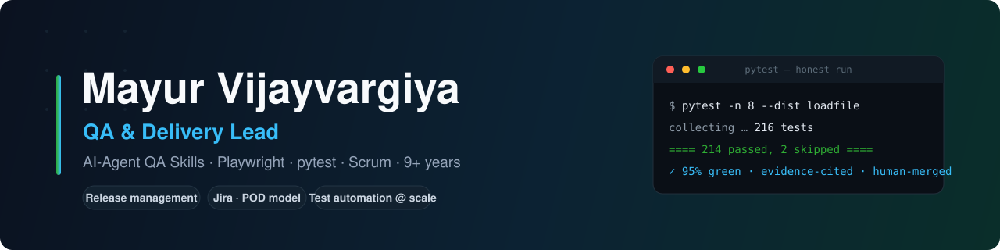
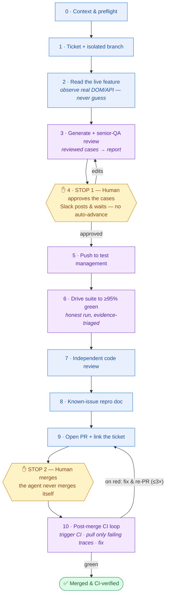
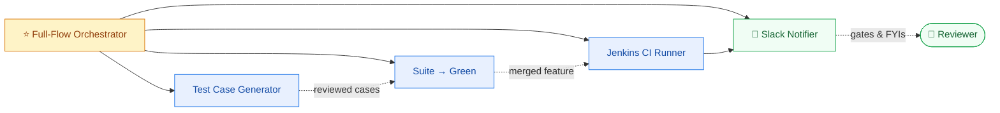

### QA &amp; Delivery Lead &nbsp;·&nbsp; AI-Agent QA Skills &nbsp;·&nbsp; Playwright / pytest &nbsp;·&nbsp; Scrum

<em>I lead QA &amp; delivery for product teams and build AI-agent "skills" that do real testing work — generating senior-reviewed test cases and driving suites to an honest green. 9+ years across product &amp; enterprise: banking, insurance, media, and industrial AI.</em>

---

## 🚀 AI-agent QA system — skills I built

I designed a **complete, agent-driven QA pipeline**: one command takes a software feature from *nothing* to a **merged, CI-verified feature** — it writes senior-QA-reviewed test cases, drives a real ≥95%-green suite, runs code review, opens the PR, and handles the post-merge CI cleanup — pausing only at the two points where a human must decide.

### ⭐ The flagship — Full-Flow Orchestrator

An **orchestrator**, not another engine: each phase either does lightweight "glue" work (ticket, live-UI read, PR) or **calls one of the specialized skills below**. Every phase reads/writes a **durable run manifest**, so a crash, a long CI wait, or a brand-new session all resume exactly where the run left off. **Two human stops only** — approve the cases, and merge.

- **Two human stops, and they're the right two** — everything else, including post-merge CI cleanup, runs unattended.
- **Resumable & crash-safe** — the run manifest survives crashes, long CI waits, and session restarts.
- **It never merges itself** — a deliberate, non-negotiable boundary.

### The building blocks

Each stands on its own; the orchestrator conducts them.

| Skill | What it does | Impact |
|-------|--------------|--------|
| [**QA Test Case Generator**](https://github.com/mvijayvargiya/qa-testcase-generator-skill) | Generates **and senior-QA-reviews** cases → Zephyr Scale | 30–80 reviewed cases / feature |
| [**Test Suite → Green**](https://github.com/mvijayvargiya/test-suite-to-green-skill) | Drives cases to an **honest ≥95%-green** pytest + Playwright suite | suite build ≈ 2 weeks → ≈ 1 day |
| **Jenkins CI Runner** | Triggers CI headlessly; on red, pulls back **only failing traces** — not the bulk archive | fast, evidence-first triage |
| **Slack Notifier** | The human-in-the-loop backbone: **blocking** approval gates vs. **non-blocking** FYIs | keeps a human in control, never blocks the run |

> **Honesty gate:** the green number comes from a real run — skips can't hide failures, every verdict cites evidence (trace / DOM / API), and nothing merges without a human.

### How the pieces fit together

---

## 🛠️ Delivery & process — how I run QA + delivery

- [**Agile Delivery Playbook**](https://github.com/mvijayvargiya/agile-delivery-playbook) — POD-based delivery + a monthly release train
- [**Jira POD Delivery**](https://github.com/mvijayvargiya/jira-pod-delivery) — Components-as-POD, boards, release versions, dashboards
- [**QA Test Plan &amp; Framework**](https://github.com/mvijayvargiya/qa-test-plan-templates) — manual QA plan + Playwright/pytest framework
- [**QA Onboarding Guide**](https://github.com/mvijayvargiya/qa-onboarding-guide) — ramp new QA hires fast

## 🧰 Tech &amp; tools

## 🎓 Certifications &amp; recognition
`ISTQB Foundation (CTFL)` &nbsp; `Agile Testing (ATA)` &nbsp; `Selenium Automation (ATA)` &nbsp; `PSM I — in progress` &nbsp; `Best Service & High-Performance awards`

---

Portfolio note: these are generalized versions of skills and systems I built for a proprietary platform — employer-specific identifiers, infrastructure, and workflows removed.

